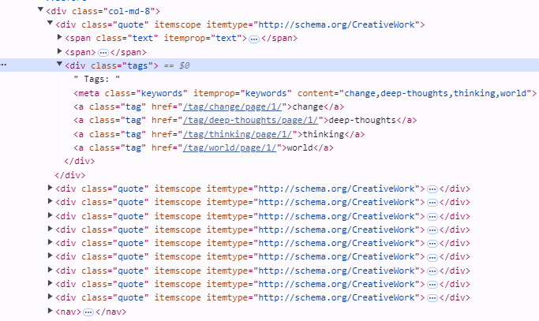

# Explanation

Locators is for where things are in HTML and how we can find things

The pages is going to contain the code to use those locator to find particular things in a page

Parsers is for find particular thing but specific to some html tags

# Pages

https://quotes.toscrape.com/

https://books.toscrape.com/ 

