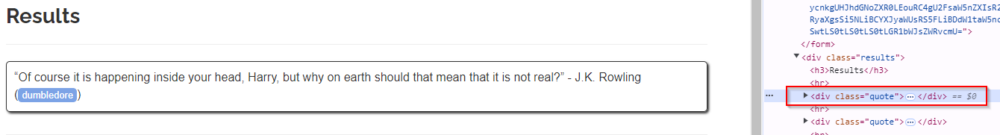
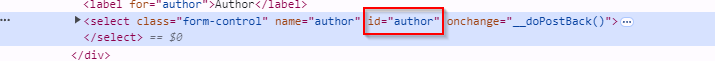

## tags selection

When selecting the tags, we always use what we need on the browser, in this case in the page quotes to scrape we use the inspector and catch the id of the resource we want from the page

